# JPA-LiTE

**JPA-LiTE** (`org.javalabs:jpa-lite`) is a lightweight Java Persistence API implementation purpose-built for high-throughput and batch processing workloads. It provides a developer-friendly abstraction over plain JDBC, eliminating boilerplate code while maintaining a significantly smaller memory footprint than mainstream JPA providers such as Hibernate and EclipseLink.

Unlike traditional JPA implementations, JPA-LiTE avoids the excessive creation of short-lived objects that leads to heap fragmentation and frequent garbage collection pauses. This makes it suitable for enterprise batch ingestion pipelines and any latency-sensitive Java application. It is framework-agnostic and works with Jakarta EE, Spring Boot, Vert.x, and plain Java SE.

**Latest stable version:** `0.0.39`

```xml
<dependency>
    <groupId>org.javalabs</groupId>
    <artifactId>jpa-lite</artifactId>
    <version>0.0.39</version>
</dependency>
```

See [CONTRIBUTING.md](CONTRIBUTING.md) to get involved, and [CODEOWNERS](CODEOWNERS) for maintainer contact.

---

## Table of Contents  
- [Background](#bg)  
- [Why JPA-LiTE ?](#wjl)
- [How to configure](#htc) 
- [Example - Without JPA-LiTE](#ewojl)
  - [Create a table](#cat)
  - [Create the POJO](#ctp)
  - [Create the DAO class](#ctdc)
- [Example - With JPA-LiTE](#ewjl)
  - [Modify the POJO](#mtp)
  - [Add the persistence.xml](#mtpx)
  - [Directly use JPA-LiTE API](#dujla)
- [Example - JPA-LiTE dependency injection](#ejldi)
  - [Modify the DAO class](#mtdcdi)
  - [Batch Insert](#bi)
  - [Use DAO in your handler/controller class](#udh)
- [Using NamedNative Query](#unnq)
  - [Define NamedNative Query](#dnnq)
  - [Query Execution](#nnqe)
  - [Criteria Query](#cq)
- [Comparison With Other Framework](#cmp)
- [Schema Genaration](#sch)

<a name="bg"/>

## Background
For those who are not from EJB era - (from wiki) Prior to the introduction of EJB 3.0 specification, many enterprise Java developers used lightweight persistent objects, provided by either persistence frameworks or data access objects instead of entity beans. This is because entity beans, in previous EJB specifications, called for too much complicated code and heavy resource footprint, and they could be used only in Java EE application servers because of inter-connections and dependencies in the source code between beans and DAO objects or persistence framework. Thus, many of the features originally presented in third-party persistence frameworks were incorporated into the Java Persistence API, and, as of 2006, projects like Hibernate (version 3.2) and TopLink (built on top of Eclipselink) Essentials have become themselves implementations of the Java Persistence API specification.

<a name="wjl"/>

## Why JPA-LiTE ?

Existing jpa implementation like Hibernate and Toplink has inherent memory issue. Blame it on the JPA spec, it creates too many short lived objects, which often lead to fragmentation. Creating too many objects in a short time span also lead to frequent garbage collection, which eventually slows down your application performance. Hence JPA was not the developer's choice when it comes to **Batch Processing**. Wherever performance is a concern, developers still prefer relying on plain old native jdbc API, which has a significantly lesser memory foot-print. (remember jdbc driver libraries are highly optimized). 
<br/>
Writing raw SQL query in java method as not recommended as it tends to make the codebase messy (we will see that soon), and as developers keep on adding new methods, soon it becomes a maintenance nightmare. Furthermore, if the underlying table gets changed (for example, a new column gets added, or change in data type, etc), one has to find all the occurrences of the table in the code, and make necessary changes, which at the same time is error prone.
<br/>
**JPA-LiTE** strikes a balance between the two. At first place, it avoids developers to write the significant amount of plumbing code, and secondly, it's APIs are optimized, thus make it suitable for batch processing. Moreover, it is not tied to any specific (java) tech stack. You can use it with any Java EE application, Springboot, Vert.x, etc.

<a name="htc"/>

## How to configure
Modify your pom file to have the below dependency:

```
<dependency>
    <groupId>org.javalabs</groupId>
    <artifactId>jpa-lite</artifactId>
    <version>0.0.38</version>
</dependency>
```

<a name="ewojl"/>

## Example - Without JPA-LiTE

<a name="cat"/>

### Create a table
Let's say, you have an **employees** table to store the employee details:

```
CREATE TABLE employees (
  emp_id     INT         NOT NULL,
  emp_name   VARCHAR(64) NOT NULL,
  join_date  TIMESTAMP   NOT NULL,
  PRIMARY KEY (emp_id)
)
```

<a name="ctp"/>

### Create the POJO

```
public class Employee {
    
    private static final AtomicInteger COUNTER = new AtomicInteger(1);
    
    private Integer empId;
    private String empName;
    private Timestamp joinDate;
    
    public Employee() {
        empId = COUNTER.getAndIncrement();
    }

    public void setEmpId(Integer empId) {
        this.empId = empId;
    }

    public Integer getEmpId() {
        return empId;
    }

    public String getEmpName() {
        return empName;
    }

    public void setEmpName(String empName) {
        this.empName = empName;
    }

    public Timestamp getJoinDate() {
        return joinDate;
    }

    public void setJoinDate(Timestamp joinDate) {
        this.joinDate = joinDate;
    }
    
    // Define the class that represents the primary key
    public static class EmployeePK implements Serializable {
        
        private Integer empId;
        
        public EmployeePK() {}

        public EmployeePK(Integer empId) {
            this.empId = empId;
        }

        public Integer getEmpId() {
            return empId;
        }

        public void setEmpId(Integer empId) {
            this.empId = empId;
        }
    }
}
```

<a name="ctdc"/>

### Create the DAO class
This interface has the appropriate methods to do CRUD operation on the underlying **employees** table.

EmployeeDAO.java
```
public interface EmployeeDAO {
    
    Employee find(Employee.EmployeePK pk);
    
    void insert(Employee emp);
    
    void update(Employee emp);
    
    void delete(Employee emp);
}
```

EmployeeDAOImpl.java
```
public class EmployeeDAOImpl implements EmployeeDAO {
    
    private Connection getConnection() throws SQLException {
        return DriverManager.getConnection("jdbc:postgresql://localhost:5432/postgres", "username", "password");
    }

    public Employee find(Employee.EmployeePK pk) {
        Connection conn = null;
        PreparedStatement pstmt = null;
        ResultSet rs = null;
        
        try {
            conn = getConnection();
            
            pstmt = conn.prepareStatement("SELECT emp_id, emp_name, join_date FROM employees WHERE emp_id = ?");
            pstmt.setInt(1, pk.getEmpId());
            rs = pstmt.executeQuery();
            
            if (rs.next()) {
                Employee emp = new Employee();
                emp.setEmpId(rs.getInt(1));
                emp.setEmpName(rs.getString(2));
                emp.setJoinDate(rs.getTimestamp(3));
                
                return emp;
            }
            return null;
        }
        catch (SQLException e) {
            e.printStackTrace();
            return null;
        }
        finally {
            // Close all resources (Connection, Statement, etc)
        }
    }

    public void insert(Employee emp) {
        Connection conn = null;
        PreparedStatement pstmt = null;
        
        try {
            conn = getConnection();
            conn.setAutoCommit(false);  // Start transaction
            
            pstmt = conn.prepareStatement("INSERT INTO employees (emp_id, emp_name, join_date) VALUES (?, ?, ?)");
            
            pstmt.setInt(1, emp.getEmpId());
            pstmt.setString(2, emp.getEmpName());
            pstmt.setTimestamp(3, emp.getJoinDate());
            
            int count = pstmt.executeUpdate();
            conn.commit();              // Commit transaction
        }
        catch (SQLException e) {
            e.printStackTrace();
            try {
                conn.rollback();        // Rollback transaction (in case of error)
            } catch (SQLException ex) {
                ex.printStackTrace();
            }
        }
        finally {
            // Close all resources (Connection, Statement, etc)
        }
    }

    @Override
    public void update(Employee emp) {
        Connection conn = null;
        PreparedStatement pstmt = null;
        
        try {
            conn = getConnection();
            conn.setAutoCommit(false);  // Start transaction
            
            pstmt = conn.prepareStatement("UPDATE employees set emp_name = ?, join_date = ? WHERE emp_id = ?");
            
            pstmt.setString(1, emp.getEmpName());
            pstmt.setLong(2, emp.getJoinDate());
            pstmt.setInt(3, emp.getEmpId());
            
            int count = pstmt.executeUpdate();
            conn.commit();              // Commit transaction
        }
        catch (SQLException e) {
            e.printStackTrace();
            try {
                conn.rollback();        // Rollback transaction (in case of error)
            } catch (SQLException ex) {
                ex.printStackTrace();
            }
        }
        finally {
            // Close all resources (Connection, Statement, etc)
        }
    }

    @Override
    public void delete(Employee emp) {
        Connection conn = null;
        PreparedStatement pstmt = null;
        
        try {
            conn = getConnection();
            conn.setAutoCommit(false);  // Start transaction
            
            pstmt = conn.prepareStatement("DELETE FROM employees WHERE emp_id = ?");
            pstmt.setInt(1, emp.getEmpId());
            
            int count = pstmt.executeUpdate();
            conn.commit();              // Commit transaction
        }
        catch (SQLException e) {
            e.printStackTrace();
            try {
                conn.rollback();        // Rollback transaction (in case of error)
            } catch (SQLException ex) {
                ex.printStackTrace();
            }
        }
        finally {
            // Close all resources (Connection, Statement, etc)
        }
    }
}
```

The above class has the following disadvantages:
1. Since JDBC is a low level standard for interaction with databases, it allows you to do more things with the Database directly, and it requires more attention.
1. For DML operation, developer has to be extra cautious while committing or rolling back the transaction. 
1. Tedious exception handling. Since all jdbc APIs throw SQLException, developer has to catch it and handle them as appropriate.
1. If creating an employee is also required to create a department mapping, then the code becomes even messier. Developer has to ensure the parent transaction is propagated (with appropriate context) and creation of Employee and Department Mapping happens as part of the same transaction (Atomic work unit).
1. If developer adds a new column (or modify existing column) to **employees** table, then all the above APIs need to be changed to incorporate the new columns.
1. For an enterprise application (where you have lots of such DAO classes), soon it becomes a maintenance nightmare.

Let's see how **jpa-lite** helps address the above issues.

<a name="ewjl"/>

## Example - With JPA-LiTE

<a name="mtp"/>

### Modify the POJO
Modify the above **Employee.java** to make it a JPA entity.

```
import java.io.Serializable;
import java.sql.Timestamp;
import java.util.Objects;
import java.util.concurrent.atomic.AtomicInteger;
import javax.persistence.Column;
import javax.persistence.Entity;
import javax.persistence.Id;
import javax.persistence.IdClass;
import javax.persistence.NamedNativeQueries;
import javax.persistence.NamedNativeQuery;
import javax.persistence.Table;

@Entity
@NamedNativeQueries({
    @NamedNativeQuery(name = "Employee.selectAll", query = "SELECT * FROM employees"),
    @NamedNativeQuery(name = "Employee.selectByLocation", query = "SELECT * FROM employees WHERE location = ?")
})
@Table(name="employees", indexes = {
    @Index(name = "employees_ik", columnList = "emp_name")
})
@IdClass(Employee.EmployeePK.class)
public class Employee implements Serializable {
    
    private static final AtomicInteger COUNTER = new AtomicInteger(1);
    
    @Id
    @Column(name = "emp_id", nullable = false)
    private Integer empId;
    
    @Column(name = "emp_name", nullable = false, length = 64)
    private String empName;
    
    @Column(name = "join_date", nullable = false)
    private Timestamp joinDate;
    
    public Employee() {
        empId = COUNTER.getAndIncrement();
    }

    // Regular getter and setter methods
    // ....
    // ....
    
    // Define the class that represents the primary key
    public static class EmployeePK implements Serializable {
        
        private Integer empId;
        
        public EmployeePK() {}

        public EmployeePK(Integer empId) {
            this.empId = empId;
        }

        public Integer getEmpId() {
            return empId;
        }

        public void setEmpId(Integer empId) {
            this.empId = empId;
        }

        @Override
        public int hashCode() {
            int hash = 3;
            hash = 53 * hash + Objects.hashCode(this.empId);
            return hash;
        }

        @Override
        public boolean equals(Object obj) {
            if (this == obj) {
                return true;
            }
            if (obj == null) {
                return false;
            }
            if (getClass() != obj.getClass()) {
                return false;
            }
            final EmployeePK other = (EmployeePK) obj;
            if (!Objects.equals(this.empId, other.empId)) {
                return false;
            }
            return true;
        }
        
    }
}
```

<a name="atpx"/>

### Add the persistence.xml

The persistence.xml configuration file is used to configure a given JPA-LiTE Persistence Unit. The Persistence Unit defines all the metadata required to bootstrap an EntityManagerFactory, like entity mappings, data source, and transaction settings, as well as JPA provider configuration properties.
Ensure this file contains all the model class (for example, Employee, etc). Place this file in your project classpath (typically inside src/main/resources directory).

```
<?xml version="1.0" encoding="UTF-8" ?>

<persistence xmlns="http://java.sun.com/xml/ns/persistence"
    xmlns:xsi="http://www.w3.org/2001/XMLSchema-instance"
    xsi:schemaLocation="http://java.sun.com/xml/ns/persistence
    http://java.sun.com/xml/ns/persistence/persistence_2_0.xsd" version="2.0">

    <persistence-unit name="emp-pu">
        <description>Employee Persistence Unit</description>
        <provider>org.javalabs.jpa.LitePersistenceProvider</provider>
        
        <class>org.javalabs.test.model.Employee</class>
        
        <properties>
            <property name="javax.persistence.jdbc.url" value="jdbc:postgresql://localhost:5432/postgres"/>
            <property name="javax.persistence.jdbc.user" value="username"/>
            <property name="javax.persistence.jdbc.password" value="password"/>

            <property name="jpa-lite.logging.level" value="TRACE"/>
            <property name="jpa-lite.dao.package" value="org.javalabs.test.dao"/>
        </properties>
    </persistence-unit>
</persistence>
```

<a name="dujlp"/>

### Directly use JPA-LiTE API
You can directly use the EntityManagerFactory and EntityManager to create and/or employee data.

```
public class TestMain {
    
    public static void main(String[] args) {
        EntityManagerFactory emf = Persistence.createEntityManagerFactory("emp-pu");
        EntityManager em = null;
        
        try {
            em = emf.createEntityManager();
            em.getTransaction().begin();
            
            Employee emp = newEmployee();
            em.persist(emp);
            System.out.println("Created employee " + emp.getEmpName());
            
            em.getTransaction().commit();
        }
        catch (JdbcException e) {
            e.printStackTrace();
            if (em != null) {
                em.getTransaction().rollback();
            }
        }
        finally {
            if (em != null) {
                em.close();
            }
            if (emf != null) {
                emf.close();
            }
        }
    }
    
    private static Employee newEmployee() {
        Employee emp = new Employee();
        emp.setEmpName("Sudiptasish Chanda");
        emp.setJoinDate(new Timestamp(System.currentTimeMillis()));
        
        return emp;
    }
}
```

<a name="ejldi"/>

## JPA-LiTE dependency injection

You can use the dependency injection with JPA-LiTE in order to avoid creating the EntityManagerFactory and EntityManager. All you need to do is to annotate your dao interface with **@Dao** annotation.

<a name="mtdcdi"/>

### Modify the DAO class

EmployeeDAO.java
```
@Dao
public interface EmployeeDAO {
    
    Employee find(Employee.EmployeePK pk);
    
    void insert(Employee emp);
    
    void update(Employee emp);
    
    void delete(Employee emp);
}
```

EmployeeDAOImpl.java
```
public class EmployeeDAOImpl implements EmployeeDAO {

    @PersistenceContext(name = "emp-pu")
    private EntityManager em;

    public Employee find(Employee.EmployeePK pk) {
        return em.find(Employee.class, pk);
    }

    public void insert(Employee emp) {
        em.persist(emp);
    }

    @Override
    public void update(Employee emp) {
        em.merge(emp);
    }

    @Override
    public void delete(Employee emp) {
        em.remove(emp);
    }
}
```

Your DAO class is now simplified to a great extent.

Note that, once you use the **@Dao** annotation, then JPA-LiTE will ensure that there is a single instance of EmployeeDAOImpl class inside your JVM. Hence it is strongly discouraged to have a global variable defined inside your DAO class.

<a name="bi"/>

### Batch Insert

You can use JPA-LiTE to batch insert your records. No additional setting is needed.

```
public class EmployeeDAOImpl implements EmployeeDAO {

    @PersistenceContext(name = "emp-pu")
    private EntityManager em;

    ....
    ....

    public void batchInsert(List<Employee> emps) {
        for (Employee emp : emps) {
            em.persist(emp);
        }
    }

    ....
    ....
}
```

As soon as the control comes out of this method, your transaction will be committed.

<a name="udh"/>

### Use DAO in your handler/controller class

You can obtain the instance of the DAO class using the below code:
```
public class EmployeeHandler {
    
    private final EmployeeDAO empDAO;
    
    public EmployeeHandler() {
        empDAO = DAOProxy.get(EmployeeDAO.class);
    }
    
    public void create() {
        long start = System.currentTimeMillis();
        
        Employee emp = newEmployee();
        empDAO.insert(emp);
        long end = System.currentTimeMillis();
        
        System.out.println(String.format(
                "Created new employee [%d]. Elapsed time (ms): %d"
                , emp.getEmpId(), (end - start)));
    }
    
    public static Employee newEmployee() {
        Employee emp = new Employee();
        emp.setEmpName("Sudiptasish Chanda");
        emp.setJoinDate(new Timestamp(System.currentTimeMillis()));
        
        return emp;
    }
}
```

<a name="unnq"/>

## Using NamedNative Query

<a name="dnnq"/>

### Define NamedNative Query
The NamedNativeQueries can be defined as below:

```
// import statement

@Entity
@NamedNativeQueries({
    @NamedNativeQuery(name = "Employee.selectAll", query = "SELECT * FROM employees"),
    @NamedNativeQuery(name = "Employee.selectCount", query = "SELECT COUNT(*) FROM employees"),
    @NamedNativeQuery(name = "Employee.selectByLocation", query = "SELECT * FROM employees WHERE location = ?")
})
@Table(name = "employees")
@IdClass(Employee.EmployeePK.class)
public class Employee implements Serializable {
  ....
  ....
}
```

<a name="nnqe"/>

### Query Execution

```
public class EmployeeDAOImpl implements EmployeeDAO {

    @PersistenceContext(name = "emp-pu")
    private EntityManager em;

    ....
    ....

    public Integer selectCount() {
        // This API will return a single result, i.e., an integer.
        return (Integer) em.createNamedQuery("Employee.selectCount")
            .getSingleResult();
    }

    public List<Object[]> selectAll() {
        return em.createNamedQuery("Employee.selectAll")
            .getResultList();
    }

    public List<Object[]> selectByLocation(String location) {
        // This API will return a list and the individual list entry is an object array.
        return em.createNamedQuery("Employee.selectByLocation")
            .setParameter(1, location)
            .getResultList();
    }

    public List<Employee> selectByLocation_v2(String location) {
        // This API will return a list and the individual list entry is a concrete Employee object.
        return em.createNamedQuery("Employee.selectByLocation", Employee.class)
            .setParameter(1, location)
            .getResultList();
    }

    ....
    ....
}
```

<a name="cq"/>

### Criteria Query

You can use the Criteria query to fetch records based on several criteria. This is different than the conventional Criteria API or CriteriaBuilder API as defined in JPA 2.0 spec. JPA-LiTE does not support CriteriaBuilder API, as in a high throughput environment, Ceriteria API along with OneToOne/OneToMany join, contribute to maximum memory fragmentation.
<br/>
JPA-LiTE uses a rather simplified version of Criteria Query. Note that it does not support join yet. If you want to join multiple tables, use `NamedNativeQuery` instead.

**Example 1**: Select all employees who are from New York with a salary more than 120000

```
public class EmployeeDAOImpl implements EmployeeDAO {

    @PersistenceContext(name = "emp-pu")
    private EntityManager em;

    public List<Object[]> query(String location, Long salary, int offset, int limit) {
        Criteria criteria = new Criteria()
            .select("emp_id", "emp_name", "location", "join_date", "salary")
            .from("employees")
            .where("location").eq("New York")
            .and("salary").gt(120000);
            
        Query q = em.createNativeQuery(criteria.toQuery());
        
        int idx = 1;
        for (Object bind : criteria.params()) {
            q.setParameter(idx ++, bind);
        }
        q.setFirstResult(offset);   // Pagination - Start index (Optional)
        q.setMaxResults(limit);     // Pagination - Max number of records to be retrieved (Optional)
        
        return q.getResultList();
    }
}
```

**Example 2**: Select all employees who's name like John and are from New York with a salary more than 120000

```
public class EmployeeDAOImpl implements EmployeeDAO {

    @PersistenceContext(name = "emp-pu")
    private EntityManager em;

    public List<Object[]> query() {
        Criteria criteria = new Criteria()
            .select("emp_id", "emp_name", "location", "join_date", "salary")
            .from("employees")
            .where("location").eq("New York")
            .and("name").like("%John%")
            .and("salary").gt(120000);
        
        ....
        ....
    }
}
```

**Example 3**: Select all employees who resides in Salt Lake and New York, sort them by name

```
public class EmployeeDAOImpl implements EmployeeDAO {

    @PersistenceContext(name = "emp-pu")
    private EntityManager em;

    public List<Object[]> query() {
        Criteria criteria = new Criteria()
            .select("emp_id", "emp_name", "location", "join_date", "salary")
            .from("employees")
            .where("location").in(Arrays.asList("Salt Lake", "New York"))
            .orderBy("emp_name");
        
        ....
        ....
    }
}
```

**Example 4**: Select department wise average salary (only the departments where the average salary is more than 100000). Sort the result by average salary in descending order.

```
public class EmployeeDAOImpl implements EmployeeDAO {

    @PersistenceContext(name = "emp-pu")
    private EntityManager em;

    public List<Object[]> query() {
        Criteria criteria = new Criteria()
            .select("department", "AVG(salary)")
            .from("employees")
            .groupBy("department")
            .having("AVG(salary)").gt(100000)
            .orderBy("AVG(salary)")
            .desc();
        
        ....
        ....
    }
}
```

**Example 5**: Select distinct department name.

```
public class EmployeeDAOImpl implements EmployeeDAO {

    @PersistenceContext(name = "emp-pu")
    private EntityManager em;

    public List<Object[]> query() {
        Criteria criteria = new Criteria()
            .selectDistinct("department")
            .from("employees");
        
        ....
        ....
    }
}
```

**Example 6**: Fetch all employees who joined between 01-Apr-2020 and 31-Mar-2021.

```
public class EmployeeDAOImpl implements EmployeeDAO {

    @PersistenceContext(name = "emp-pu")
    private EntityManager em;

    public List<Object[]> query() {
        Criteria criteria = new Criteria()
            .select("emp_id", "emp_name", "location", "join_date", "salary")
            .from("employees")
            .where("join_date").between("01-Apr-2020").and("31-Mar-2021");
        
        ....
        ....
    }
}
```

**Example 7**: Fetch all employees who either work from Chicago or Boston.

```
public class EmployeeDAOImpl implements EmployeeDAO {

    @PersistenceContext(name = "emp-pu")
    private EntityManager em;

    public List<Object[]> query() {
        Criteria criteria = new Criteria()
            .select("emp_id", "emp_name", "location", "join_date", "salary")
            .from("employees")
            .where("location").eq("Chicago")
            .or("location").eq("Boston");
        
        ....
        ....
    }
}
```

**Example 8**: Select count of all employees who belong to a department.

```
public class EmployeeDAOImpl implements EmployeeDAO {

    @PersistenceContext(name = "emp-pu")
    private EntityManager em;

    public List<Object[]> query() {
        Criteria criteria = new Criteria()
            .selectCount("*")
            .from("employees")
            .where("department").isNotNull();
        
        ....
        ....
    }
}
```

<a name="cmp"/>

## Comparison With Other Framework

### Comparison With Hibernate And Eclipselink

#### Background

The performance test activities will be limited to the batch transactions as defined in the subsequent sections in this document. The test strategy assumes that there is no other activity going on in the database. Performance testing scenarios that are modelled on the real life transactions and user load would be
carried out on the system to investigate the ingestion time, system response, resource utilization and other system parameters.

#### Infrastructure

Database - PostgreSQL
A table with **34** columns have been created to compare the ingestion time between JPA-LiTE and Hibernate.

| Datatype   | Count   |
| ----------|-----------------|
| VARCHAR       | 26 |
| TIMESTAMP       | 4 |
| INT       | 4 |

Length of a row: **1398 Byte** or **1.37 KB**.

Record to be inserted = **1 Million**
Ingestion size = **1.31 GB**
Batch size = **1000**

#### Test Preparation

Two test programs have been created.
1. JPALiTETest.java
2. HibernateTest.java
3. EclipselinkTest.java

There are total **10** executions. In each execution each of these scripts will insert **1 million** records in the database. Response times of each transaction along with all other necessary parameters pertaining to performance testing will be measured.

Tool Used: To measure the resource utilization and other system parameters, Java Mission Control has been used. See below the script:

```
# export JFR_OPTS_J="-XX:StartFlightRecording=duration=200s,settings=profile,filename=jpalite.jfr"
# export JFR_OPTS_H="-XX:StartFlightRecording=duration=200s,settings=profile,filename=hibernate.jfr"
# export JFR_OPTS_H="-XX:StartFlightRecording=duration=200s,settings=profile,filename=eclipselink.jfr"

export JFR_OPTS=$JFR_OPTS_J
java -XX:+UnlockCommercialFeatures -XX:+FlightRecorder $JFR_OPTS -jar target/benchmarking-1.0-SNAPSHOT.jar
```

Depending on the script, either of `JFR_OPTS_J` and `JFR_OPTS_H` will be enabled.

#### Test Execution

The test is executed in 10 iteration. During first phase, jpa-lite script is executed and the report has been generated. In next phase, hibernate script has been executed and once again the report has been captured. In every phase, both the scripts inserted 1 million records. The JVM has been given time to warm-up before starting ingestion.
The ingestion time is the average of all **n** iterations.

| Framework   | Avg Time (ms)   |  Range  |
| ----------|-----------------|------------|
| JPA-LiTE       | `42` |  `39 ms` to `45 ms` |
| Hibernate       | `51` | `40 ms` to `56 ms` |
| Eclipselink       | `54` | `42 ms` to `64 ms` |

#### Test Result

**1. Memory Utilization**

| Framework   | Allocation   |  Min  | Max |
| ----------|----------------|-------|-----|
| JPA-LiTE       | `1 GB` |  `16 MB` | `64 MB` |
| Hibernate       | `1 GB` | `128 MB` | `384 MB` |
| Eclipselink       | `1.25 GB` | `128 MB` | `500 MB` |

1.1 Hibernate:

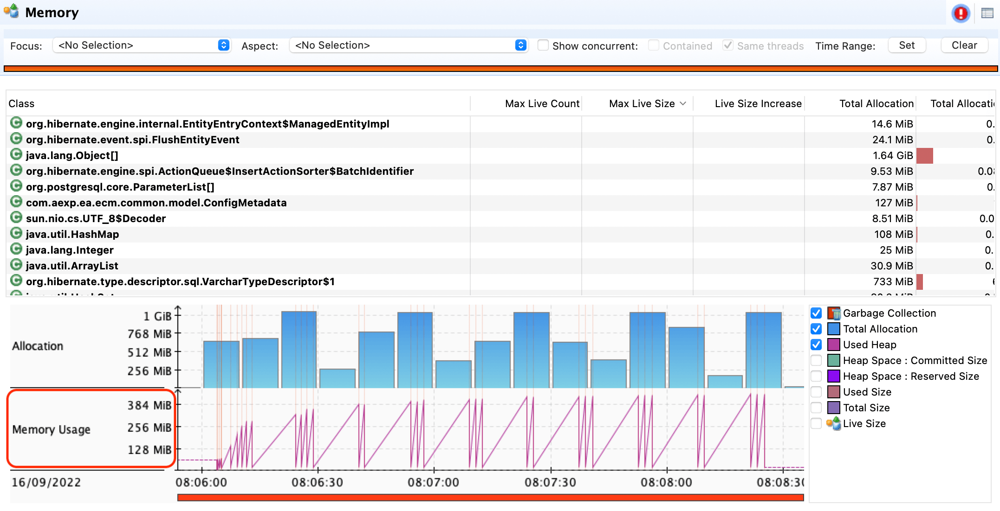<br/>

1.2 Eclipselink:

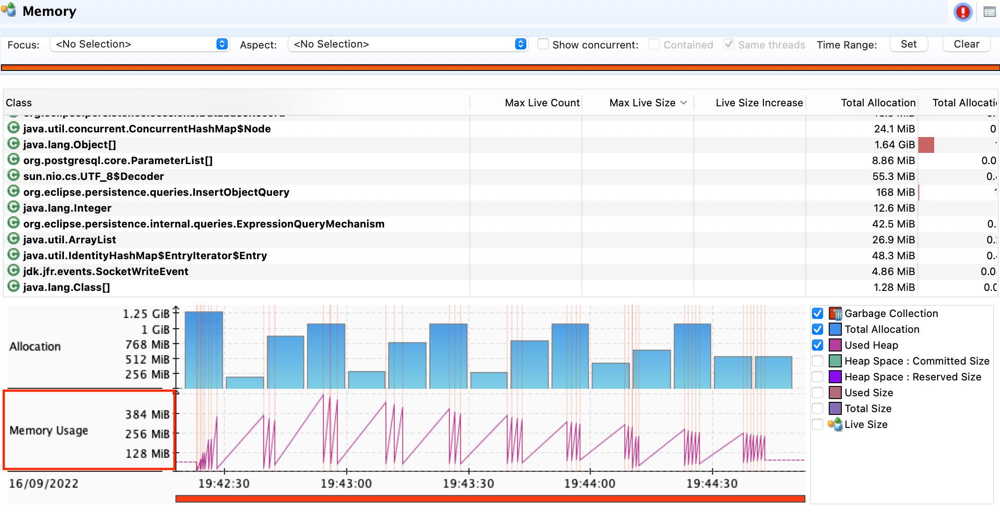<br/>

1.3 JPA-LiTE:

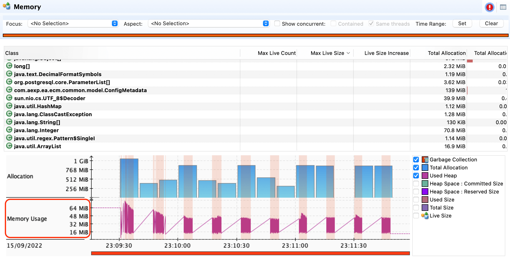<br/>

**2. Garbage Collection**

| Framework   | Heap   |  Longest Pause  | Heap Post GC |
| ----------|----------------|-------|-----|
| JPA-LiTE       | `32 MB - 64 MB` |  `21.34 ms` | `8 MB` |
| Hibernate       | 256 MB | `56.32 ms` | `16 MB` |
| Eclipselink       | `256 MB` | `51.411 ms` | `64 MB` |

2.1 Hibernate:

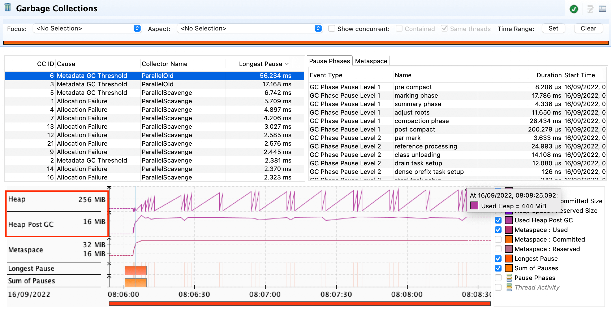<br/>

2.2 Eclipselink:

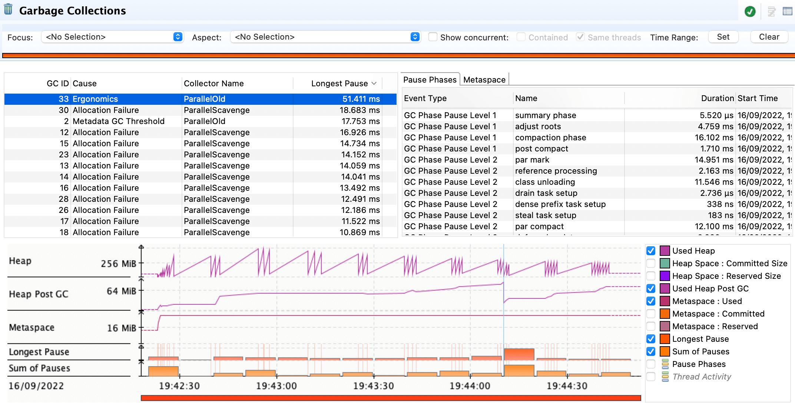<br/>

2.3 JPA-LiTE:

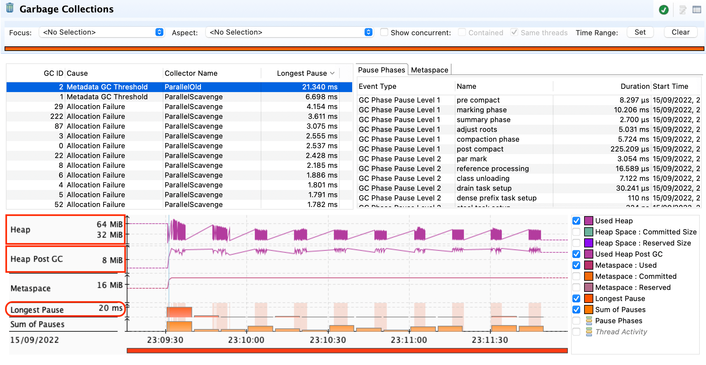<br/>

**3. Class Loading**

| Framework   | Loaded Class  |
| ----------|----------------|
| JPA-LiTE       | `2500` |
| Hibernate       | `5000` |
| Eclipselink       | `2500` |

3.1 Hibernate:

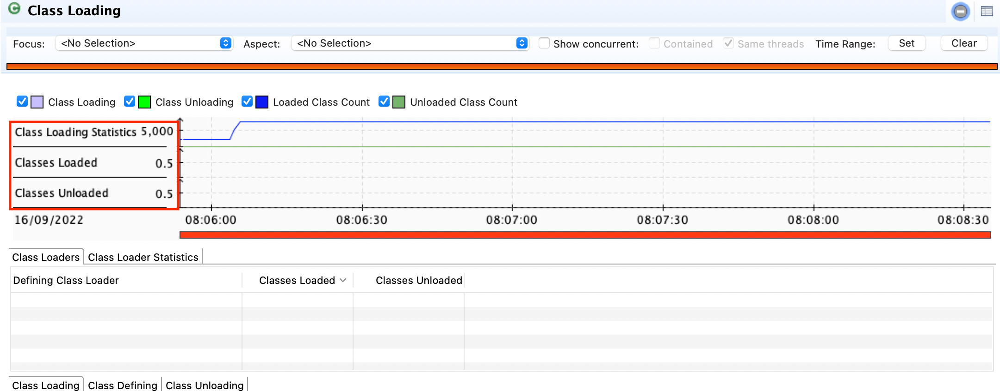<br/>

3.2 Eclipselink:

<br/>

3.3 JPA-LiTE:

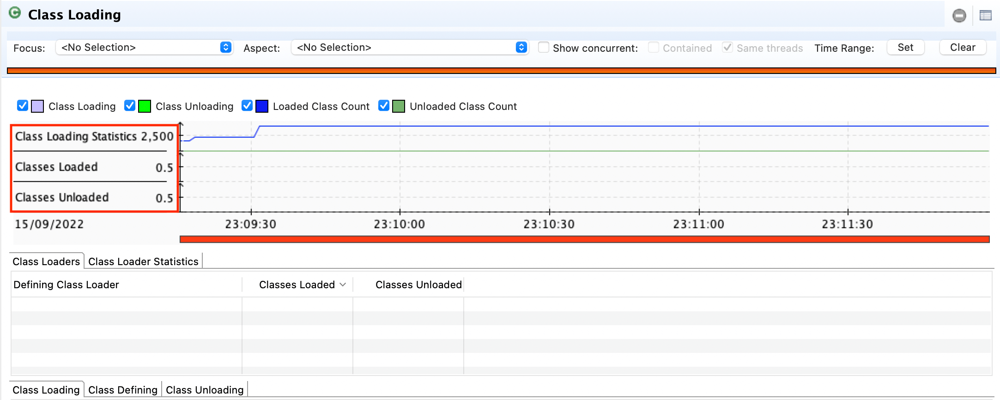<br/>

**4. TLAB Statistics**

| Framework   | Allocation  |
| ----------|----------------|
| JPA-LiTE       | `8.9 GB` |
| Hibernate       | `10.7 GB` |
| Eclipselink       | `11.1 GB` |

4.1 Hibernate:

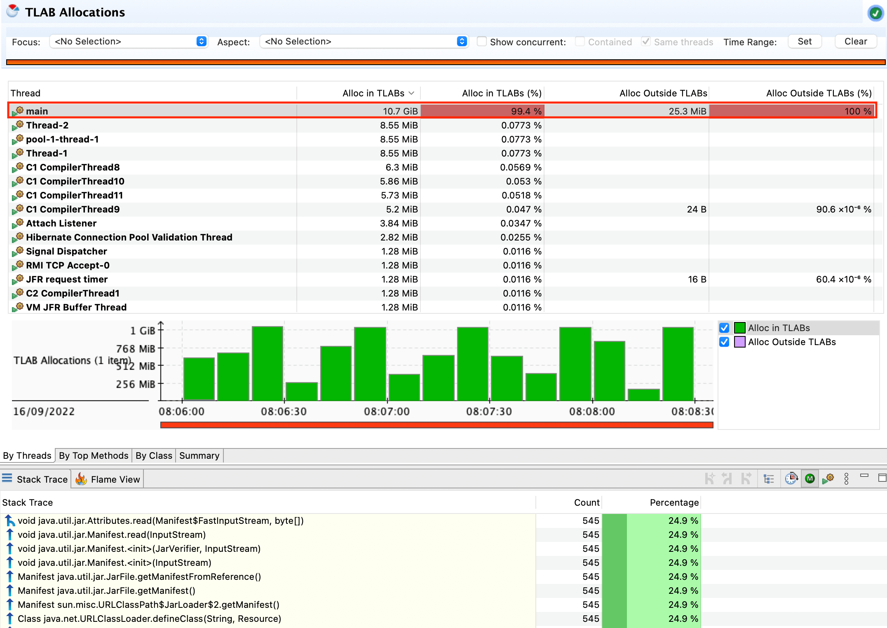<br/>

4.2 Eclipselink:

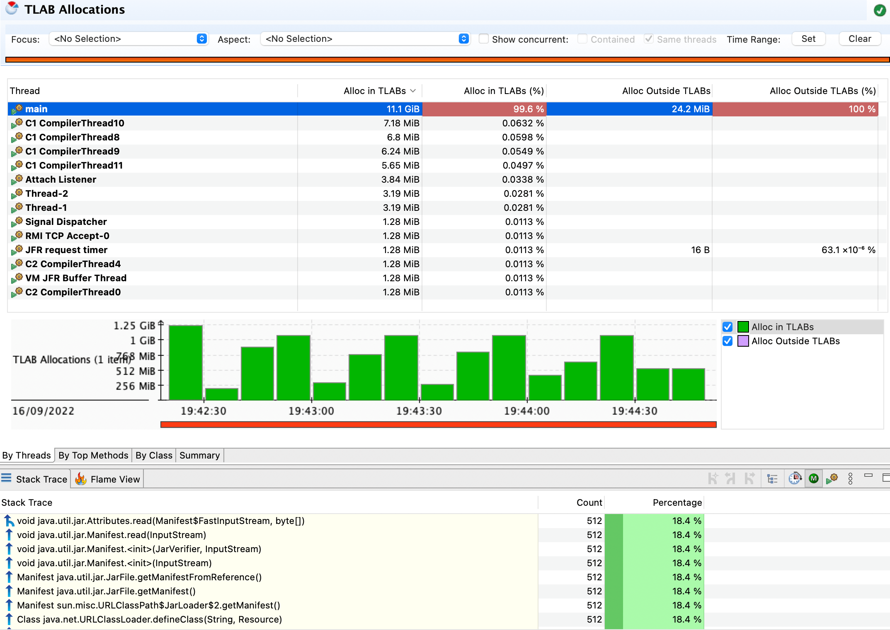<br/>

4.3 JPA-LiTE:

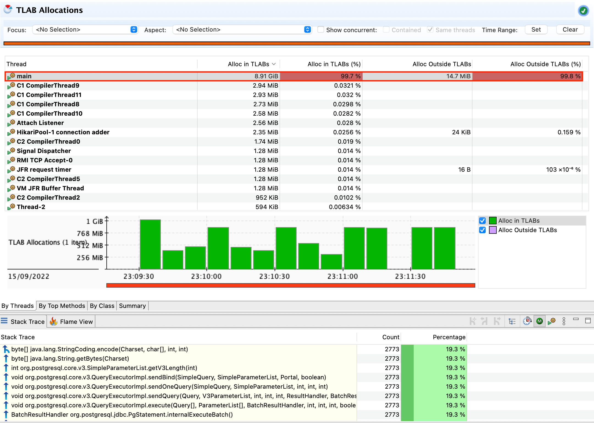<br/>

**5. CPU Usage**

| Framework   | CPU Avg  | CPU Start |
| ----------|----------------|--------|
| JPA-LiTE       | `1.95%` | `14.6%` |
| Hibernate       | `1.87%` | `22.3%` |
| Eclipselink       | `2.8%` | `18%` |

5.1 Hibernate:

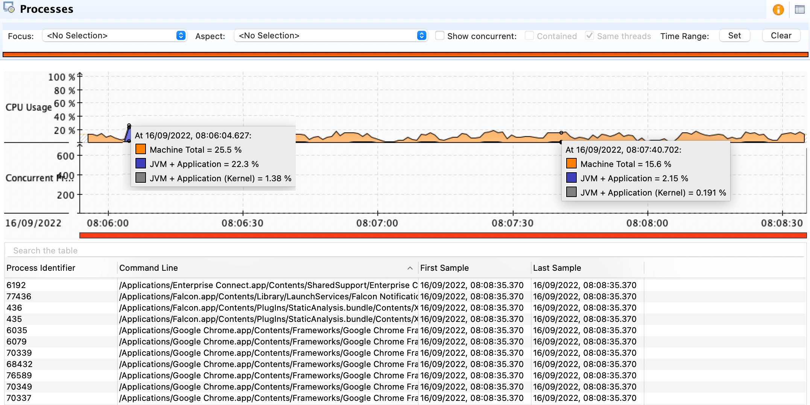<br/>

5.2 Eclipselink:

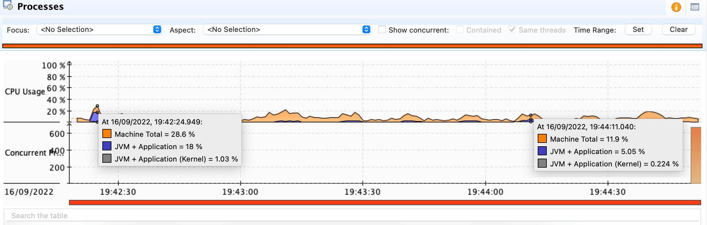<br/>

5.3 JPA-LiTE:

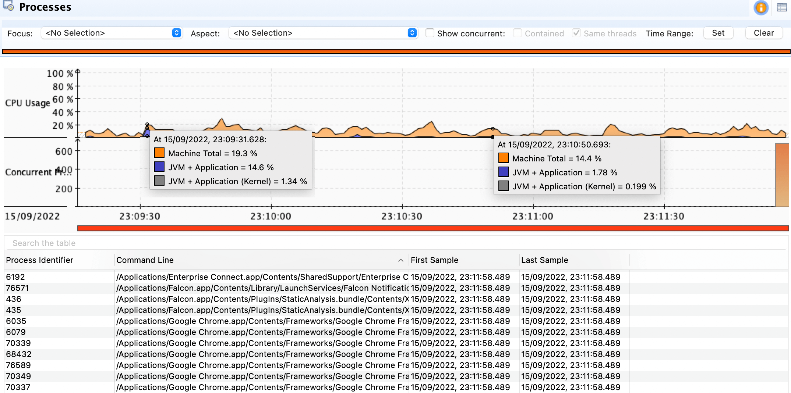<br/>


<a name="sch"/>

## Schema Generation

You can generate the table scripts, constraint index definition by following the steps below:

1. Add the dependency in your `pom.xml` file.
```
<dependency>
    <groupId>org.javalabs</groupId>
    <artifactId>jpa-lite</artifactId>
    <version>0.0.38</version>
</dependency>
```
This in turn will download the jpa-spec `javax.persistence-api` library

2. Create a JPA entity.

Employee.java

```
package com.example.model;

import java.io.Serializable;
import java.sql.Timestamp;
import javax.persistence.*;

@Entity
@Table(name="employees", indexes = {
    @Index(name = "employees_ik", columnList = "department")
})
@IdClass(Employee.EmployeePK.class)
public class Employee implements Serializable {

    @Id
    @Column(name = "emp_id", nullable = false)
    private Integer empId;

    @Column(name = "emp_name", nullable = false, length = 64)
    private String empName;

    @Column(name = "department", nullable = true, length = 32)
    private String department;

    @Column(name = "join_date", nullable = false)
    private Timestamp joinDate;

    public Employee() {}

    // Generate setters and getters ...

    // Primary key (inner) class
    public static class EmployeePK implements Serializable {
        
        private Integer empId;
        
        public EmployeePK() {}

        // Generate setter, getter, equals and hashCode ...
        
    }
}
```

3. Create a `persistence.xml` file

```
<?xml version="1.0" encoding="UTF-8" ?>

<persistence xmlns="...." version="2.0">
    <persistence-unit name="test-pu">
        <description>Employee Persistence Unit</description>
        <provider>org.javalabs.jpa.LitePersistenceProvider</provider>
        
        <class>com.example.model.Employee</class>
        
        <properties>
            <!-- Defines the target location of the create script generated by the persistence provider -->
            <property name="javax.persistence.schema-generation.scripts.create-target" value="db/schema.sql"/>
        </properties>

        </properties>
    </persistence-unit>
</persistence>
```

4. Project Structure:

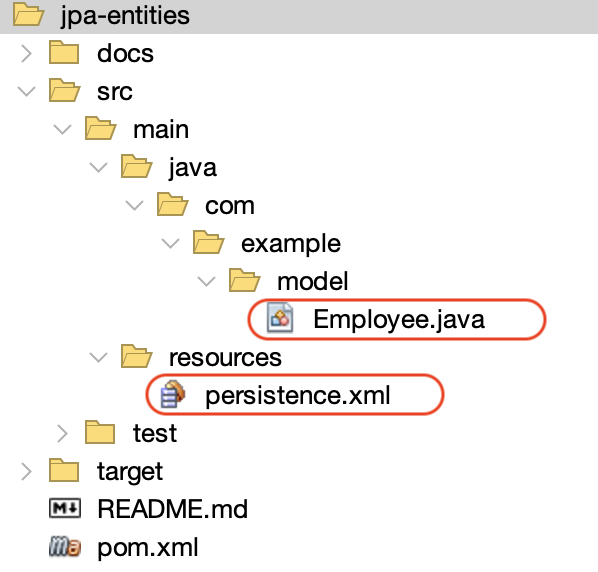<br/>

5. Create a jar, say `entities.jar` that will have the jpa entities (i.e., `Employee.class`) as well as the `persistence.xml` file.

6. Run the following command:

`
./schema-gen -p test-pu -d postgres -l /path/to/jpa-entities.jar -o test_schema.sql
`
<br/><br/>
It will generate two sql scripts `test_schema.sql` and `test_schema_drop.sql` in the current directory.
<br/><br/>
Open the script `test_schema.sql`, and voila you have the ddl script generated for `postgres` db.

test_schema.sql
```
-- Run the below script to generate the tables --
-- psql -d ecmdb -U ecm -a -f /path/to/test_schema.sql --

-- Table Script --

CREATE TABLE employees (
    emp_id          NUMBER      NOT NULL,
    emp_name        VARCHAR(64) NOT NULL,
    department      VARCHAR(32)         ,
    join_date       TIMESTAMP   NOT NULL
);

CREATE  INDEX employees_ik
ON employees
USING BTREE (department);
```


7. Type `--help` to see other options:

`
./schema-gen --help
`

## Appendix - SQL Dialect

Following table explains the dialect name.

| Dialect   | Database Name   |   Jdbc Url   |   Driver class    |
| ----------|-----------------|--------------|-------------------|
| db2       | DB2 databse | `jdbc:db2://localhost:50001/<db_name>` |  |
| derby     | Derby database | `jdbc:derby://localhost:1527/<db_name>` |  |
| h2        | H2 database | `jdbc:h2:tcp://localhost:9092/~/<db_name>` |  |
| mysql     | MySql database | `jdbc:mysql://localhost:3306/<db_name>`  |  |
| oracle    | Oracle database | `jdbc:oracle:thin:@localhost:1521:<db_name>` |  |
| postgres  | Postgres database | `jdbc:postgresql://localhost:5432/<db_name>` |  |
| sybase    | Sybase database | `jdbc:sybase:Tds:localhost:server-port` |  |

